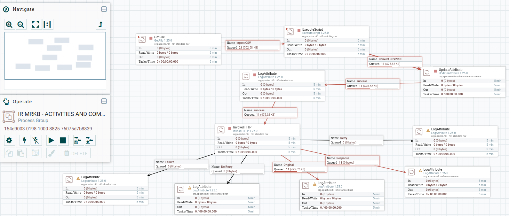

# Apache NiFi Process

An Apache NiFi workflow template designed to automate the transformation and loading of the IR log datasets into a Knowledge Graph.

The workflow ingests CSV datasets, transforms them into RDF/Turtle format using ontology mappings, and loads the generated semantic data into Ontotext GraphDB.

## Workflow Overview

The NiFi pipeline automates the following tasks:

1. CSV dataset ingestion
2. CSV to RDF/Turtle transformation using ontology based semantic mapping
3. RDF data loading into Ontotext GraphDB
4. Logging, monitoring, and debugging of workflow execution

## Pipeline Architecture

The workflow consists of the following Apache NiFi processors:

| Processor | Purpose |
|------------|---------|
| GetFile | Ingests CSV datasets into the workflow |
| ExecuteScript (Groovy) | Transforms CSV data into RDF/Turtle format using ontology mappings |
| UpdateAttribute | Configures HTTP headers and request attributes for GraphDB communication |
| LogAttribute | Provides monitoring and debugging information |
| InvokeHTTP | Sends RDF/Turtle data to Ontotext GraphDB |
| Additional LogAttribute Processors | Captures responses including success, failure, retry, no-retry, and original flowfile outcomes |

## Data Flow




```text
CSV Dataset
     ↓
GetFile
     ↓
ExecuteScript (Groovy)
     ↓
RDF/Turtle Generation
     ↓
UpdateAttribute
     ↓
InvokeHTTP
     ↓
Ontotext GraphDB

```

## Research Publication

If you use this project Nifi Pipeline please cite the following paper(s):

> H. S. Galadima, C. Doherty and R. Brennan,
> "Semantic Log Aggregation for a Machine Readable Knowledge Base of Incident Response Activities,"
> 2025 Cyber Research Conference - Ireland (Cyber-RCI), Galway, Ireland, 2025, pp. 1-4.
> DOI: 10.1109/Cyber-RCI68134.2025.11384833

Publication Link: https://ieeexplore.ieee.org/document/11384833/


